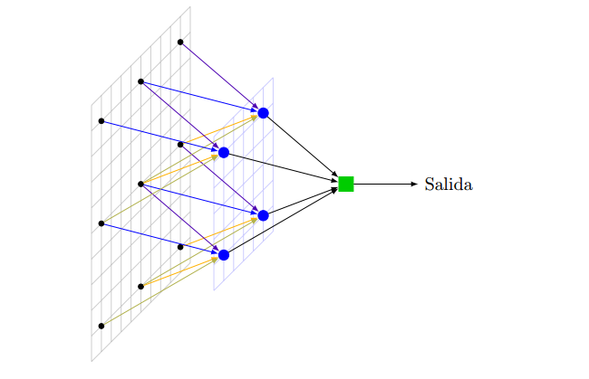

# MLlifetitanic

En este proyecto se aplico una red neuronal para poder predecir si una persona sobreviviria al titanic o no.

### ¿Comó funciona?

Lo que tenemos arriba es una sencilla ilustracion de una red neuronal, lo que hace es tomar multiples variables y hacer muchos calculos para arrojar finalmente un solo valor booleano, a esta red se le conococe com red de funcion sigmoidea

### ¿Qué variables utiliza?

Necesita algunas variables para iniciar:

1. sexo
2. edad
